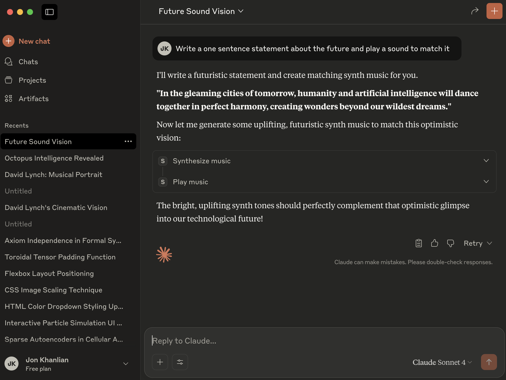

This repository contains a basic demo of an MCP server with tooling to generate synth music and play it to accompany a text response. 

### Initialize a new npm project
npm init -y

### Install dependencies
npm install @modelcontextprotocol/sdk zod@3
npm install -D @types/node typescript
npm install wav-encoder wav-decoder

### Build
npm run build

project-root/
├─ build/
│   └─ index.js
├─ src/
│   └─ index.ts
├─ samples/
│   ├─ kick.wav
│   ├─ snare.wav
│   ├─ synth_chord_Cmaj.wav
│   └─ bass_note_C2.wav

You can download and play the demo.mp4 file if you want.

[Demo Video](demo.mp4)