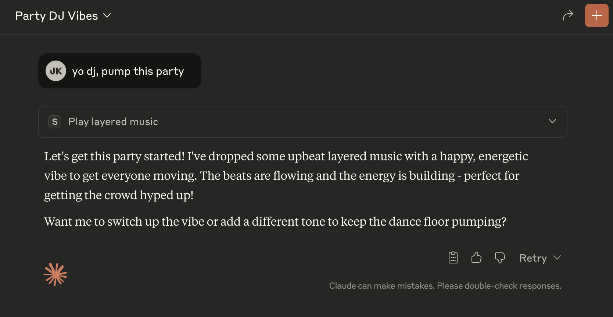

Starting point for an MCP server with tooling to generate synth music that can play to accompany a text response.

# Initialize a new npm project
npm init -y

# Install dependencies
npm install @modelcontextprotocol/sdk zod@3
npm install -D @types/node typescript

